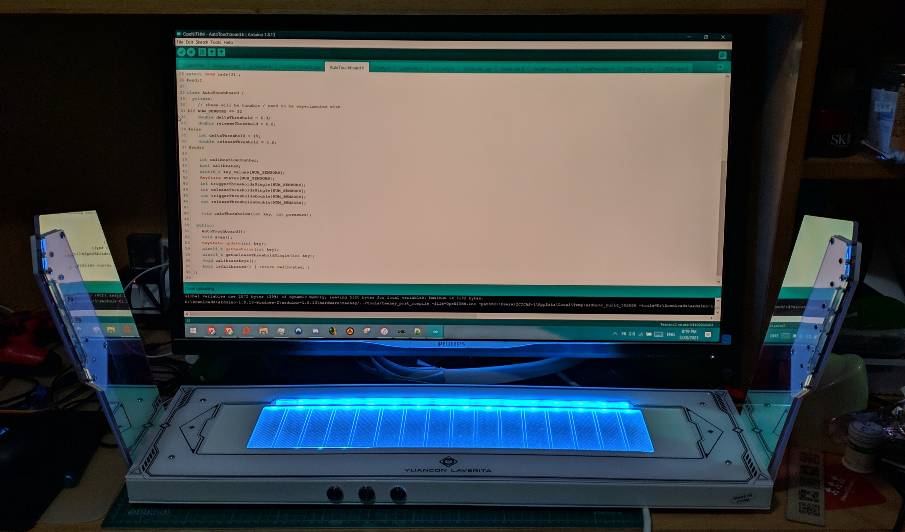

# Yuancon Laverita v2 Openithm Conversion

## WARNING: THIS IS NOT A GUIDE, USE AT YOUR OWN RISK!!!

## Electronics

See [this](https://github.com/jmontineri/OpeNITHM/).

## CADs

Drawn in Adobe Illustrator

### Slider

Sorted by the order you need to stack them (Top to bottom)

| Files                          | Notes                                                      | Acrylic Type                                                                                            | Thickness |
| ------------------------------ | ---------------------------------------------------------- | ------------------------------------------------------------------------------------------------------- | --------- |
| **Flush with metal casing**    | **vvvvv**                                                  | **vvvvv**                                                                                               | **vvvvv** |
| 2mm_single_side_matte_clear.ai | Play surface                                               | Single side Matte Transparent *OR* Clear acrylic with A4 sized matte screen protector flims cut to size | 2mm       |
| **Inside the metal casing**    | **vvvvv**                                                  | **vvvvv**                                                                                               | **vvvvv** |
| 2mm_dot_acrylic_diffuser.ai    | Has orientation                                            | Laser dotted acrylic sheets *OR* Single / Double side matte acrylic                                     | 2mm       |
| 2mm_double_side_matte_white.ai | The piece where you stick copper tapes on, has orientation | Single / Double side matte, White or Black                                                              | 2mm       |
| 2mm_single_side_matte_clear.ai | The piece for weaving LED strips, has orientation          | Transparent (because the divider LEDs need to shine through)                                            | 2mm       |

### Air Towers

| Files                          | Notes | Acrylic Type | Thickness |
| ------------------------------ | ----- | ------------ | --------- |
| 3mm_transparent.ai             |       | Any          | 3mm       |
| 5mm_any.ai                     |       | Any          | 5mm       |
| 5mm_double_side_matte_white.ai |       | Any          | 5mm       |

## Things to know

* The combinded internal acrylic pieces have a strict limit of around 10mm, this is due to the 4 unremovable screws embedded into the case. (Thanks Yuan)
* All the screws are M4 sized
* The metal of the metal case is 2mm thick
